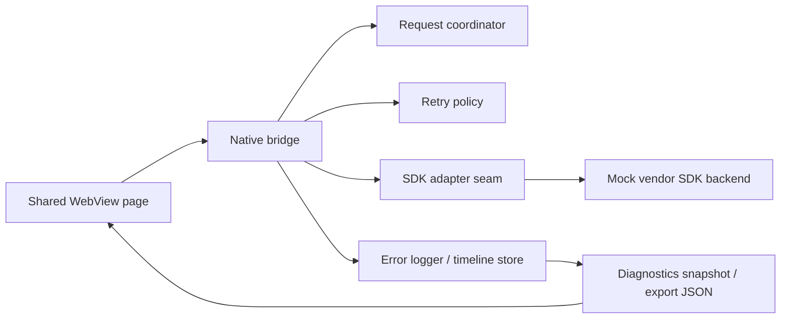

# Architecture

## Intent

This repository models a legacy hybrid payment flow where business actions live in a WebView but the actual SDK interaction and platform lifecycle risks live in native code. The architecture is designed to answer one question clearly:

`When a charge or balance request fails, can we prove where the failure happened?`

## System Shape



Two platform shells implement the same shape:

- Android: `WebViewActivity -> NativeBridge -> RailPlusSdkAdapter`
- iOS: `WebViewDemoView -> IOSNativeBridge -> RailPlusSdkAdapter`

## Shared Design Rules

The project keeps a few rules constant across platforms:

1. The visible business actions stay stable.
2. The bridge, not the SDK adapter, owns lifecycle-sensitive delivery rules.
3. Failure scenarios are deterministic and preset-driven.
4. Every request gets a `correlationId`.
5. Diagnostics are additive and do not replace the legacy contract.

## Android Stack

Key files:

- [WebViewActivity.java](/E:/프로젝트/위시켓/Android%20Java%20WebView%20Bridge%20+%20SDK%20에러%20핸들링%20데모%20—%20Qwen%20Code%20CLI%20프롬프트/app/src/main/java/com/demo/railbridge/WebViewActivity.java)
- [NativeBridge.java](/E:/프로젝트/위시켓/Android%20Java%20WebView%20Bridge%20+%20SDK%20에러%20핸들링%20데모%20—%20Qwen%20Code%20CLI%20프롬프트/app/src/main/java/com/demo/railbridge/bridge/NativeBridge.java)
- [BridgeRequestCoordinator.java](/E:/프로젝트/위시켓/Android%20Java%20WebView%20Bridge%20+%20SDK%20에러%20핸들링%20데모%20—%20Qwen%20Code%20CLI%20프롬프트/app/src/main/java/com/demo/railbridge/bridge/BridgeRequestCoordinator.java)
- [BridgeResponseFactory.java](/E:/프로젝트/위시켓/Android%20Java%20WebView%20Bridge%20+%20SDK%20에러%20핸들링%20데모%20—%20Qwen%20Code%20CLI%20프롬프트/app/src/main/java/com/demo/railbridge/bridge/BridgeResponseFactory.java)
- [MockRailSdkAdapter.java](/E:/프로젝트/위시켓/Android%20Java%20WebView%20Bridge%20+%20SDK%20에러%20핸들링%20데모%20—%20Qwen%20Code%20CLI%20프롬프트/app/src/main/java/com/demo/railbridge/sdk/MockRailSdkAdapter.java)

Android flow:

1. `WebViewActivity` loads `file:///android_asset/webview/index.html`
2. `RailBridge` is injected through `addJavascriptInterface`
3. `NativeBridge` parses params and creates a request context
4. `BridgeRequestCoordinator` registers ownership and timeout deadline
5. `RetryHandler` retries retryable adapter failures
6. `MockRailSdkAdapter` applies the active preset
7. `ErrorLogger` records stage events into request timelines
8. `BridgeResponseFactory` appends additive metadata
9. `window.onBridgeResult(...)` receives the final payload

## iOS Stack

Key files:

- [MainView.swift](/E:/프로젝트/위시켓/Android%20Java%20WebView%20Bridge%20+%20SDK%20에러%20핸들링%20데모%20—%20Qwen%20Code%20CLI%20프롬프트/ios/RailBridgeIOS/RailBridgeIOS/MainView.swift)
- [WebViewDemoView.swift](/E:/프로젝트/위시켓/Android%20Java%20WebView%20Bridge%20+%20SDK%20에러%20핸들링%20데모%20—%20Qwen%20Code%20CLI%20프롬프트/ios/RailBridgeIOS/RailBridgeIOS/WebViewDemoView.swift)
- [IOSNativeBridge.swift](/E:/프로젝트/위시켓/Android%20Java%20WebView%20Bridge%20+%20SDK%20에러%20핸들링%20데모%20—%20Qwen%20Code%20CLI%20프롬프트/ios/RailBridgeIOS/RailBridgeIOS/Bridge/IOSNativeBridge.swift)
- [MockRailSdkAdapter.swift](/E:/프로젝트/위시켓/Android%20Java%20WebView%20Bridge%20+%20SDK%20에러%20핸들링%20데모%20—%20Qwen%20Code%20CLI%20프롬프트/ios/RailBridgeIOS/RailBridgeIOS/SDK/MockRailSdkAdapter.swift)

iOS mirrors the Android contract with `WKWebView` constraints in mind:

1. `IOSNativeBridge` injects `window.RailBridge`
2. JS posts messages through `window.webkit.messageHandlers.railBridge`
3. The same four business actions are dispatched natively
4. Timeouts, duplicate suppression, and abandonment stay bridge-owned
5. Diagnostics are cached into JS globals so the existing page can read them synchronously

This is the one place where parity is conceptual rather than byte-for-byte identical: Android can return diagnostics synchronously through `JavascriptInterface`, but iOS has to keep a synchronized cache because `WKScriptMessageHandler` is message-based.

## Bridge Contract

### Preserved business actions

- `requestCharge`
- `getBalance`
- `getSdkStatus`
- `reportError`

### Base response shape

```json
{
  "status": "success",
  "method": "getBalance",
  "data": {},
  "retryCount": 0
}
```

### Additive metadata

```json
{
  "callbackId": "optional",
  "correlationId": "uuid",
  "platform": "android | ios",
  "stage": "js_callback",
  "durationMs": 187,
  "scenario": "timeout",
  "vendorCode": "VENDOR_TIMEOUT",
  "retryable": true,
  "resolvedByRetry": true
}
```

The key architectural decision is that these fields are additive. Existing JS can keep working even if it ignores all of them.

## Failure Simulation Layer

The adapter seam exists so the bridge does not care whether the backend is real or simulated.

Preset list:

- `normal`
- `timeout`
- `internal_error`
- `callback_loss`
- `duplicate_callback`
- `retry_exhausted`

What the adapter is allowed to decide:

- whether a callback fires
- whether a success arrives twice
- whether the first attempts fail in a retryable way
- whether a terminal vendor-style error should be emitted

What the adapter is not allowed to decide:

- whether a late callback should still be delivered to JS
- whether a timed-out request still owns the result
- whether a destroyed screen should receive a callback

Those are bridge concerns.

## Request Ownership And Hardening

`BridgeRequestCoordinator` makes asynchronous ownership explicit.

It tracks:

- `correlationId`
- `method`
- `callbackId`
- `scenario`
- `startedAt`
- terminal state
- elapsed time

Terminal states:

- `pending`
- `success`
- `error`
- `timed_out`
- `abandoned`

This enables three important guarantees:

1. first terminal outcome wins
2. duplicate SDK callbacks become evidence instead of duplicate UI delivery
3. teardown abandons ownership cleanly

## Timeline Logging

Each request is recorded as a timeline of stage events rather than a single flat log line.

Typical stages:

- `js_entry`
- `native_validation`
- `sdk_start`
- `sdk_callback`
- `timeout`
- `js_callback`
- `sdk_callback_ignored_duplicate`
- `sdk_callback_ignored_timeout`
- `bridge_abandoned`

This structure is what makes the debugging report credible. It lets us say things like:

- JS entered the bridge successfully
- native validation passed
- SDK started
- callback never arrived
- bridge timeout produced the terminal error

instead of only saying "it failed."

## Diagnostics Export

The diagnostics payload includes:

- active preset
- available presets
- `inFlightRequests`
- `snapshot`
  - `schemaVersion`
  - `exportedAt`
  - `timelines`

That export is meant to support two audiences:

- engineers debugging the issue
- clients or vendor contacts who need evidence of where the failure surfaced

## Shared WebView UX

The shared HTML page is not only a demo screen. It is also the operator console for the troubleshooting story.

It keeps the original four business buttons and adds:

- preset selector
- structured timeline list
- raw payload detail
- diagnostics export
- diagnostics clear

That matters because it demonstrates "minimal architecture change, maximum observability" instead of forcing a separate internal tool.

## Why This Architecture Is Portfolio-Relevant

This repository is strongest when presented as:

- a legacy-contract-preserving bridge refactor
- a deterministic vendor-failure reproducer
- a cross-platform parity harness for debugging vocabulary
- an evidence-first troubleshooting sample

It is weaker if presented as:

- a production RailPlus app
- a live payment implementation
- proof of real vendor SLA or operational success metrics
